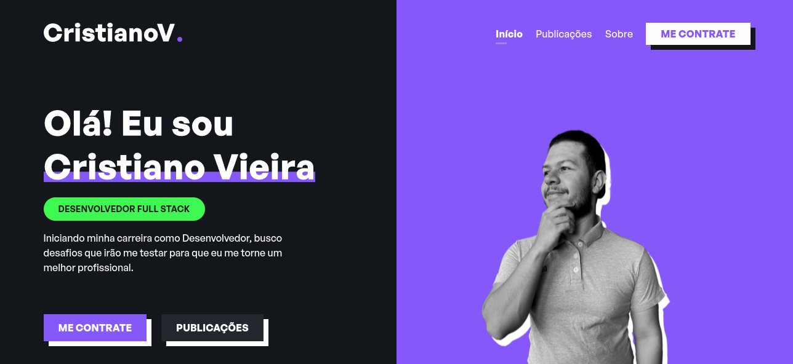
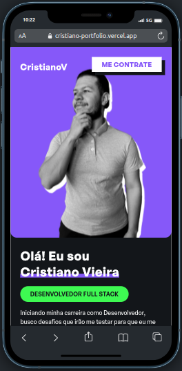

<h1 align="center">
Portfolio
</h1>

<div align="center">
  <div align="center">
    
    
  </div>
  você pode acessar atráves deste link: https://cristiano-portfolio.vercel.app/
</div>

## :books: Descrição

Sou desenvolvedor Full-stack com habilidades em Javascript, TypeScript e Python. Utilizo as tecnologias Node.js, Express.js e Nextjs para construir aplicações web escaláveis e performáticas. Tenho experiência com banco de dados MongoDB e SQL e com os frameworks de teste Jest, Mocha e Chai. Também possuo conhecimento avançado em React (Classes/Hooks/Redux/ContextAPI), HTML5 e CSS 3 (Bootstrap e tailwindcss).
Estou sempre em busca de desafios e aprendizados constantes para me tornar um profissional cada vez mais capacitado.

## :man_technologist: Tecnologias, bibliotecas e arquiteturas utilizadas no portfolio

- **React**
- **Next**
- **axios**
- **Typescript**
- **Sass**
- **prismic**
- **Emailjs**

## :raising_hand_man: Quem sou eu

Meu nome é Cristiano Vieira e sou um jovem gaúcho de 26 anos. Adoro tecnologia e desde os meus 15 anos tenho interesse por programação. No final de 2021, decidi que era hora de investir na minha carreira e comecei a estudar programação com mais afinco.

Fora do trabalho, tenho diversos hobbies. Adoro ir ao cinema, jogar video game e atirar com arco e flecha. Tenho um cachorro chamado Floki que tem 4 anos de idade e que é minha companhia nos momentos de lazer.

No geral, sou alguém que adora aprender coisas novas e desafios. Estou animado para ver onde a minha carreira de programador me levará e quais projetos emocionantes terei a oportunidade de trabalhar no futuro.

# Instruções da aplicação

### Iniciar Projeto

```
cd portfolio
npm i
npm run build
npm run start
```
